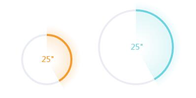

# roundProgress-by-canvas
---

---
DEMO:<http://liusainan.github.io/>
* 创建一个圆形进度条
* new roundProgress(canvas, bgcolor, pencolor)
* canvas: canvas dom, bgcolor: 设置背景圆环颜色, pencolor: 设置进度圆环颜色
* init(speed, time)
* speed 速度：次/ms
* time 时长：共ms